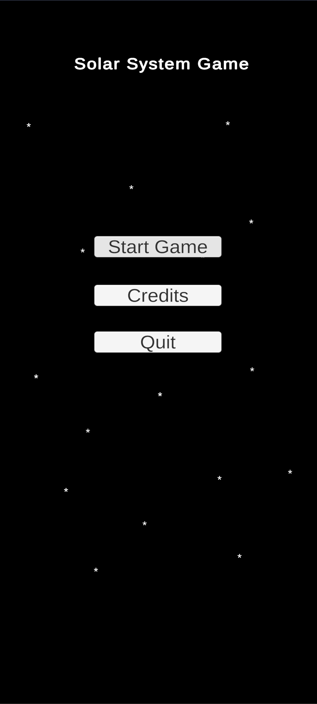
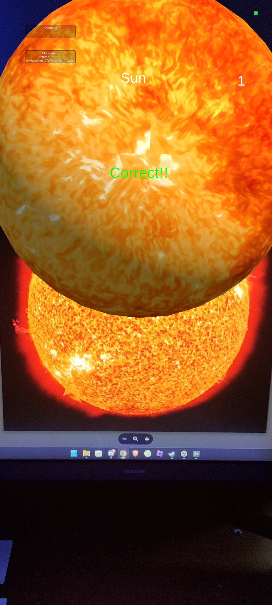

# Proyecto: Juego del Sistema Solar con AR

## Descripción
Este proyecto es un juego de realidad aumentada (AR) que utiliza **Vuforia** y su sistema de *Cloud Targeting*, el cual nos permite añadir planetas sin tener que modificar el proyecto. El objetivo del juego es identificar y escanear el planeta correcto dentro del sistema solar.

Al iniciar el juego, se selecciona un planeta de manera aleatoria, y el jugador debe utilizar su dispositivo para escanear el modelo AR del planeta correspondiente. Este juego es ideal para aprender y explorar más sobre los planetas de nuestro sistema solar de una manera interactiva y entretenida.

Este proyecto es una de las dos variantes que he programado. En esta variante, se descarga el modelo completo del planeta escaneado en 3d, y se muestra en escena.
---
## Cómo Jugar
1. Abre la aplicación en tu dispositivo móvil.
2. Un planeta será seleccionado de forma aleatoria.
3. Usa la cámara de tu dispositivo para buscar y escanear el planeta correcto.
   <a href="https://drive.google.com/drive/folders/1xhyuLGclJY2558psiMm5xvv1yv9SkUjZ?usp=sharing" target="_blank">Acceder a Imagenes</a>
5. ¡Escanea correctamente para ganar puntos, y ve los planetas en tu propia pantalla!

---
## Características
- **Realidad Aumentada (AR):** Visualización de modelos 3D de planetas en el espacio físico del usuario.
- **Selección Aleatoria:** Cada partida selecciona un planeta al azar para aumentar el reto.
- **Cloud Targeting de Vuforia:** Permite identificar y proyectar modelos AR en tiempo real.
- **Interactividad Educativa:** Fomenta el aprendizaje sobre los planetas del sistema solar.

---

## Requisitos

### Software
- Unity 6000.0.23f o superior.
- SDK de Vuforia para Unity.
- Una cuenta activa de Vuforia con acceso a Cloud Targeting.

### Hardware
- Dispositivo móvil compatible con ARCore (Android) o ARKit (iOS).
- Cámara funcional para escaneo AR.
---
## Estructura del Proyecto
- **Assets/**: Contiene todos los prefabs, scripts y componentes del juego.
- **Assets/Scenes/**: Archivos de escenas de Unity.
- **Assets/Scripts/**: Código fuente del juego.

---

## Instalación
1. Clona este repositorio
2. Abre el proyecto en Unity.
3. Configura Vuforia en Unity:
   - Importa el SDK de Vuforia desde el *Package Manager*.
   - Configura tu licencia de Vuforia y las claves de API.
4. Conéctate al sistema de Cloud Targeting:
   - Sube los datos de tus planetas al portal de Vuforia.
   - Asegúrate de configurar correctamente las bases de datos.
5. Exporta el proyecto a tu dispositivo móvil:
   - Configura los *Build Settings* de Unity para Android o iOS.
   - Genera el archivo APK o IPA e instálalo en tu dispositivo.

---

## Imágenes
#### Menú principal

#### Pantalla de juego

---
